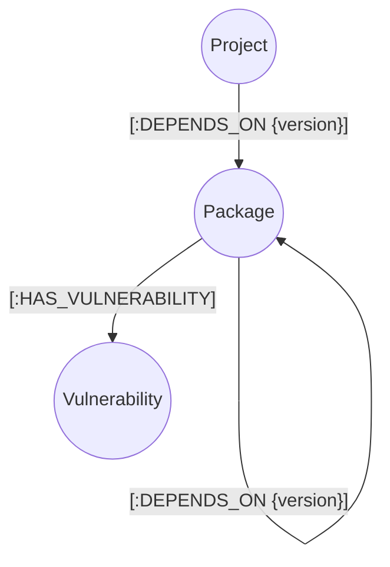

# DepGraph - Software Dependency Graph Analysis

DepGraph is a comprehensive software dependency and vulnerability tracking application. It helps engineering organizations map their software ecosystem and instantly calculate the "blast radius" of critical vulnerabilities across deeply nested dependencies.

## Why a Graph Database?

Managing software dependencies involves tracking multi-level, multi-hop transitive relationships. When a new vulnerability (like Log4Shell) is announced in a deep-level transitive package, organizations need to immediately know which of their high-level projects are affected. 

Relational databases require complex, slow, and hard-to-maintain recursive CTEs (Common Table Expressions) to traverse these arbitrary-depth dependencies. Graph databases like **CognoDB** are built for exactly this. They natively handle arbitrary-depth traversals, allowing us to easily identify the "blast radius" of a vulnerability across an entire organization's software portfolio and instantly visualize the exact dependency paths that introduce the risk.

## Data Model

The graph consists of three node labels and two relationship types:



* **Project**: Represents a top-level software artifact (e.g., Core API, Customer Dashboard).
* **Package**: Represents an open-source library or internal dependency (e.g., React, Log4j).
* **Vulnerability**: Represents a known security flaw (CVE).

## Main Cypher Queries Explained

### 1. The Blast Radius (Multi-hop Traversal)
When you click on a vulnerability, the application finds every project affected by it, regardless of how many layers deep the dependency is.
```cypher
MATCH path = (p:Project)-[:DEPENDS_ON*1..]->(pkg:Package)-[:HAS_VULNERABILITY]->(v:Vulnerability {cve_id: $cve_id})
RETURN p.name AS project, p.team AS team, [node in nodes(path) | labels(node)[0] + ' ' + coalesce(node.name, node.cve_id)] AS dependency_path
```
* `[:DEPENDS_ON*1..]` is the magic of graph databases—it traverses the dependency tree to *any* depth (1 to infinity hops).
* We return the full `path` to show the user exactly how the vulnerability reaches their project.

### 2. Project Security Audit
When viewing a specific project, we calculate all vulnerabilities it inherits:
```cypher
MATCH (p:Project {id: $id})
OPTIONAL MATCH path = (p)-[:DEPENDS_ON*1..]->(pkg:Package)-[:HAS_VULNERABILITY]->(v:Vulnerability)
RETURN p, collect({ vulnerability: v, path: path })
```

## Setup and Run Instructions

### 1. Set up CognoDB Cloud
1. Go to [console.cognodb.com/signup](https://console.cognodb.com/signup) and create a free account.
2. Create a free (c0) instance and pick a region.
3. Once provisioned, you will receive a `bolt+s://` URI and a generated password for the `cognodb` user. Save these.

### 2. Clone and Configure
1. Clone this repository.
2. Create a `.env.local` file in the root directory:
```env
COGNO_URI=bolt+s://<your-instance-id>.databases.cognodb.cloud
COGNO_PASSWORD=<your-generated-password>
```

### 3. Install & Seed Database
Install dependencies and run the seed script to populate your CognoDB instance with realistic sample data:
```bash
npm install
node scripts/seed.js
```

### 4. Run the Application
Start the Next.js development server:
```bash
npm run dev
```
Open [http://localhost:3000](http://localhost:3000) in your browser. The application features a premium dark-mode interface with glassmorphism effects, handling errors gracefully if the database is unreachable.
